Documentation
=============

.. contents::
   :local:

What does it do
---------------

The QGIS SectorPlot plugin is a plugin to show recent sectorplots or to create them based on a location in the map.

One sectorplot is saved as several polygons in a database, but can also be exported as an Esri Shapefile
or pushed over the network to a Geoserver WMS (Web Mapping Server).
Both to make it possible to view/use the sectorplots in JRodos.

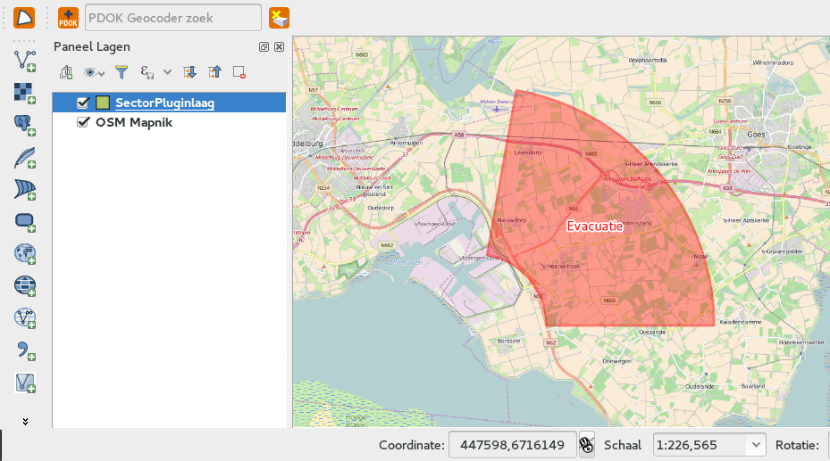

Make it work
------------

If not already installed, first install it via the QGIS plugin manager (make sure you have RIVM's own repo:
http://repo.svc.cal-net.nl/repo/rivm/qgis/plugins.xml added and enabled).

If installed you will see the sectorplot plugin icon in your QGIS toolbars:

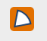

When you click the button the first time the settings window (also available via menu `Web/SectorPlot/Show settings`):

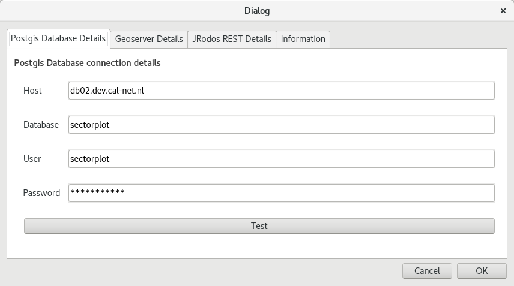

There you have to give (and test) passwords for database and web services. These can be found in Cal-net wiki.

Use it
------

First create a fresh QGIS project using epsg:3857 (World Mercator) as crs/projection, and be sure to enable
'On The Fly reprojection' (OTF). Or open such a project.

Because the NPP's (Nuclear Power Plants) are spread world wide, it is easiest to add a World map as reference layer.

There are two ways to do this:

- Get the OSM (OpenStreetMap) world map from the cal-net WMS service (http://geoserver.prd.cal-net.nl/maps)

- Install the QuickMapServices-plugin, and via Web/QuickMapService/OSM/OSM Mapnik get a world map.

Now click the SectorPlot button, the next screen will appear with a list of recent sectorplots.

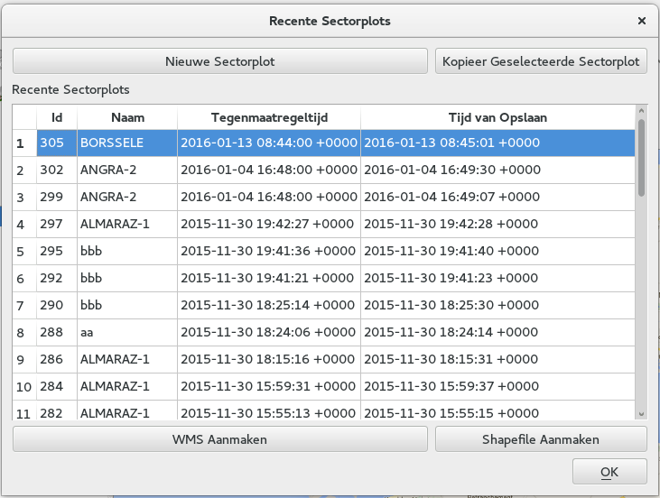

NOTE that a once created/saved SectorPlot can not be deleted anymore. It can only be COPIED first and
then changed an saved again.

Now click the button 'New SectorPLot'.

To set the location, the user is presented with the following screen:

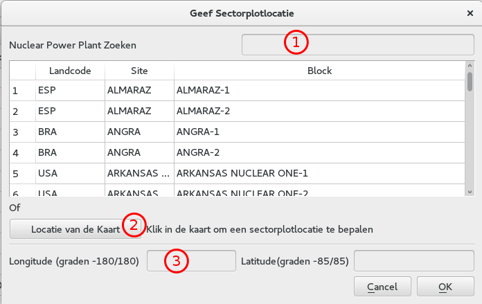

There are 3 ways to set the location:

- at (1) search for a county code, site name or block name, and select a NPP

- at (2) via this button you can click in the map so the coordinates will be set in the (3) input boxes

- at (3) directly set the lon/lat coordinates in the lon/lat input boxes.

Below an example where the user searches for Borselle.

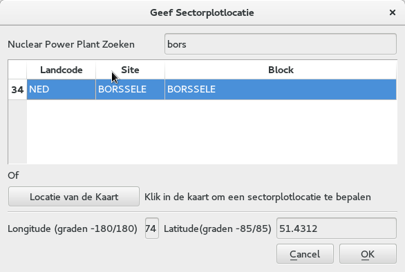

NOTE: the last search will be remembered for a user

Accepting the location dialog by clicking OK, and you will be presented the next dialog:

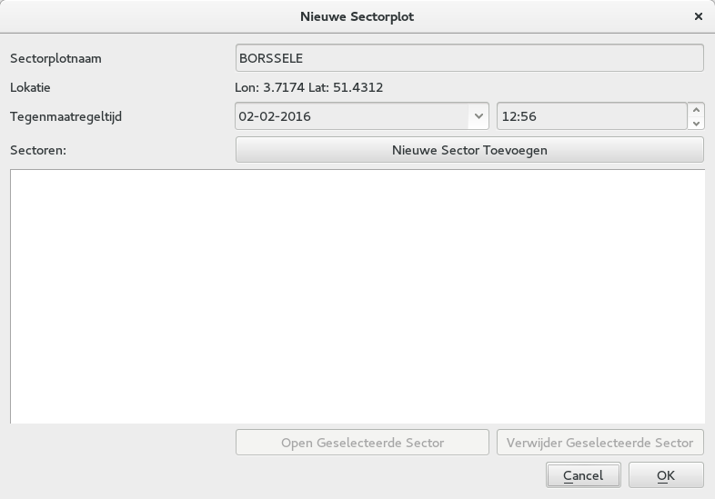

In this screen a temporary name will be set (the Block name) and the location is set.
Also the countermeasure time is set at 'now' but can be changed at will.

Create the first 'sector' of the sectorplot by clicking the button 'Add New Sector'.

You will see the 'Sector dialog':

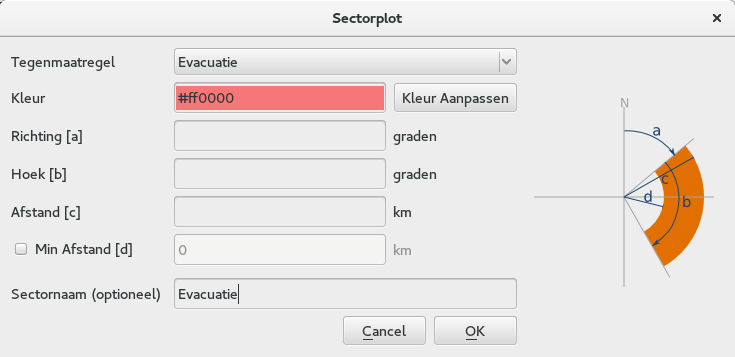

In that dialog you have to give specific information about the sector, either by filling the
text inputs by hand OR in case of a NPP with a 'Pie-plot', by clicking on a pie-sector (see example below).

The following values should be present:

- the CounterMeasure

- which has specified colors, which can be overridden

- a Direction (in degrees)

- an Angle (in degrees)

- a Distance (in km)

- optionally you can set a Min Disance (in km)

- You can set a custom name for the sector.

There is a button 'Preview' to preview the result in the map.

Below an example in which the user clicked on the 'Pie plot' of Borselle and then added a
Min Distance of 5 km, and hit the preview botton:

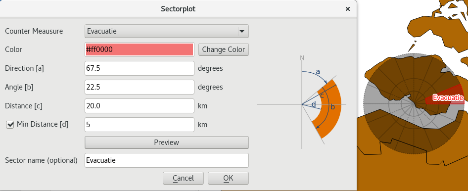

After clicking Ok the sector will be added to the list of 'Sectors' and you are able to create another
sector.

Below is an example of a sectorplot with three sectors:

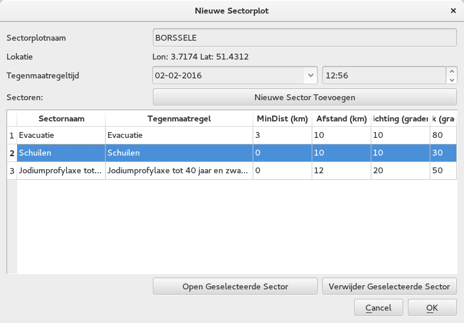

Some notes:

The drawing order is determined by the order of adding them to the list.

You can rearrange the order by dragging the number in the first column to another position.

You can edit a sector by double clicking it, or by selecting it and using the button 'Open Selected Sector'.

You can also remove a sector from the list, by selecting it and using the button 'Remove Selected Sector'.

After adding enough sectors, click 'OK and the full SectorPlot will be added to the list of Recent SectorPlots.

The last created sector will be selected and is presented in the Map.

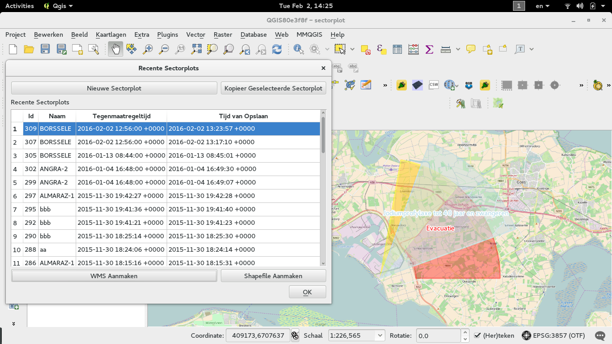

To publish a SectorPlot into Geoserver:

- select it in the list

- click 'Create WMS'

If all is ok, you will be presented with an alert showing the layername that is to be used to view it in JRodos using a WMS

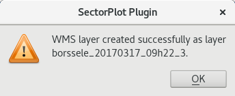

You can see this layer / SectorPlot in JRodos by making a WMS connection in JRodos to

 http://geoserver.dev.cal-net.nl/geoserver/sectorplots/wms

and searching for the layername from the alert.

To create an Esri Shapefile of the SectorPlot:

- select it in the list

- click 'Create Shapefile'

You will be asked where to save the file (actually a set of at least 5 files...).

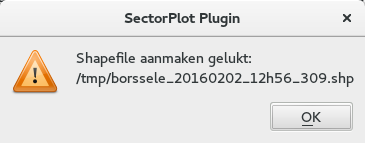

The plugins also creates a style file (a SLD file) next to the shape.

When you open the local shape file in JRodos this style file will be used.

Note that QGIS itself does not automatically use that .sld file currently,
but you can load it via the layer properties though.

Development
-----------

Repo's:

- https://github.com/rduivenvoorde/sectorplot

- https://git.svc.cal-net.nl/qgis/sectorplotplugin

All dialogs in english. Create dutch version via `make transup` see below.

NOTE: all strings in plugins should be surrounded by `self.tr()` to be sure
they show up in the .po files::

 text=self.tr(u'Sector plot')

 Create a new translation (given you work with sphinx)::

  # update the nl.ts file using
  make transup
  # load the nl.ts file in Linguist and translate all strings
  make transclean
  # compile the ts file to qm file which can be used in the plugin
  make transcompile

To create a zip for the repository::

 # make sure you can create docs (sphinx in path)
 make zip

This will first copy all needed files to `.qgis2/python/plugins/SectorPlot` and then zip that directory
and place in the the directory `repo`.

To develop live, either create a symlink in `.qgis2/python/plugins/SectorPlot` to the dev environment.

To deploy the plugin: RIVM has their own plugin repo: http://repo.svc.cal-net.nl/repo/rivm/qgis/plugins.xml

This is a web directory with:

- the lastes version of SectorPlot.zip
- een plugins.xml with the data of all plugins in that dir
- een plugins.xsl just for viewing the xml

Creating a new version:

- in SectorPlot/metadata.txt in item General, upgrade the 'version' number

- in plugins.xml on website and repo update the element
::

 <pyqgis_plugin name="SectorPlot" version="0.4">

- create a new zip

- scp both plugins.xml and SectorPlot.zip to the webdir